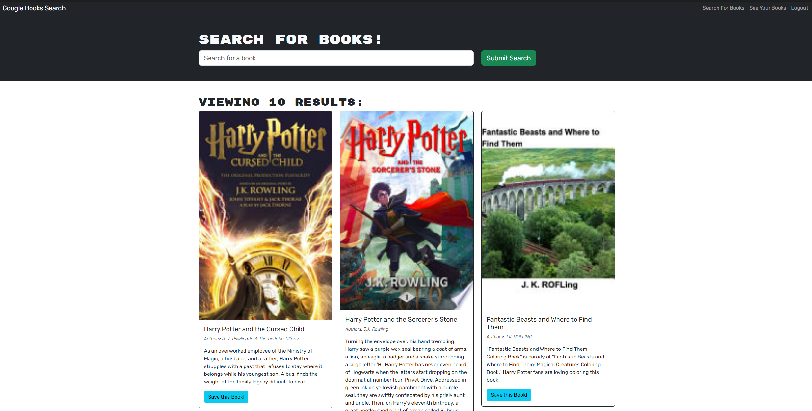
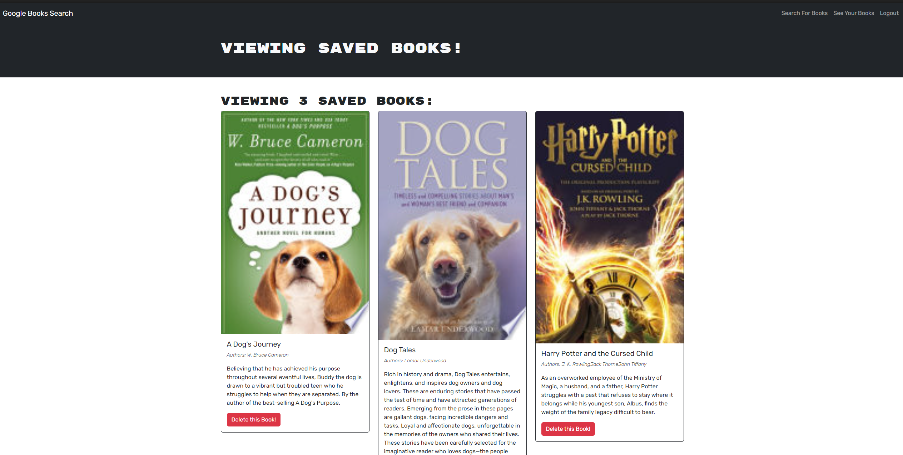

# MERN Book Search Engine

## Description
This project involves taking a fully functioning Google Books API search engine built with a RESTful API, and refactoring it to be a GraphQL API built with Apollo Server. The app was built using the MERN stack, with a React front end, MongoDB database, and Node.js/Express.js server and API. Users enter a search term and then books related to the search term are rendered to the screen. If users are logged in, they may save book to their saved books list. They may also delete a book from the saved books list.

## Table of Contents
1. [Usage](#usage)
2. [Instructions](#instructions)
3. [Links](#links)
4. [Acknowledgements](#acknowledgements)
5. [Author](#author)

## Usage
In order to use this application, you must have node.js installed on your machine. You will also need a package.json with the required dependencies. Before installing dependencies, run "npm init" to create a package.json file. After running npm init, then run "npm i to install dependencies. 

## Instructions
1. Clone the repository to your machine
2. Copy the files to your own repository
3. Conduct the git add, commit, and push commands to update your repository with the copied files
4. Follow the Usage instructions above to install necessary dependencies.
5. Modify the code to meet your needs
6. Commit and push your changes

## Links
- [GitHub Repository](https://github.com/hwoolford/mern-book-search)
- [Deployed Application](https://book-search-9ojn.onrender.com/)

## Acknowledgements
- I would like to acknowledge the assistance provided by Xpert, an AI Learning Assistant, and ChatGPT in providing guidance and support throughout the development of this project. The insights and suggestions received were invaluable in helping me overcome challenges and improve the quality of my work.

## Author
My name is Heather Woolford and I am a student learning full stack web development at the University of New Hampshire.
[Find Me on GitHub](https://gist.github.com/hwoolford)
